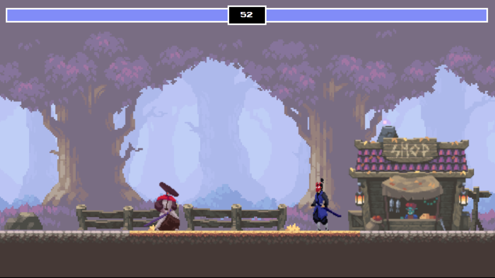
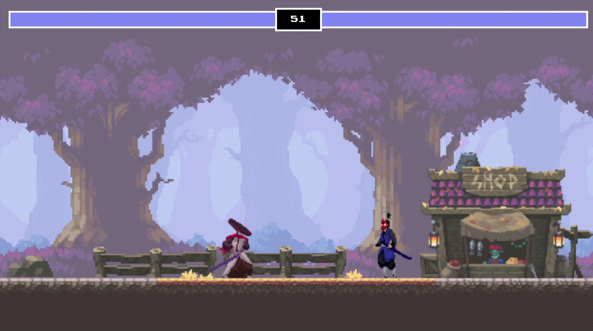
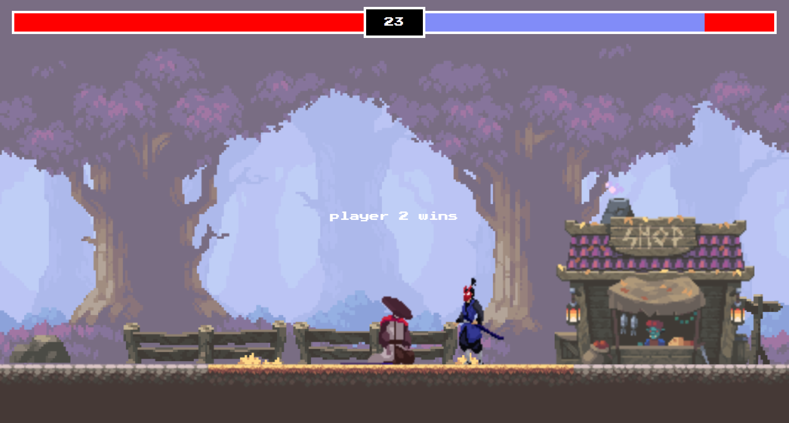

# 2D Fighting Game ⚔️

A fully-featured 2D fighting game built with HTML5 Canvas and JavaScript, featuring animated sprite characters, combat mechanics, and local multiplayer gameplay.

## 📸 Screenshots

### Main Gameplay

*Two fighters in combat with health bars and timer visible*

### Character Animations

*Animated sprite demonstrations showing idle, run, jump, and attack moves*

### Game Over Screen

*Winner announcement display*


## 🕹️ Controls

### Player 1 (Samurai Mack - Left Side)
- **A** - Move left
- **D** - Move right  
- **W** - Jump
- **Space** - Attack

### Player 2 (Kenji - Right Side)
- **←** (Left Arrow) - Move left
- **→** (Right Arrow) - Move right
- **↑** (Up Arrow) - Jump
- **↓** (Down Arrow) - Attack

## 🎯 How to Play

1. Each player starts with 100 health points
2. Move around the arena and attack your opponent
3. Each successful hit deals 20 damage
4. Win by either:
   - Reducing opponent's health to 0
   - Having more health when the 60-second timer runs out
5. Players cannot move or attack after death


## 🎮 Features

- **Two playable characters**: Samurai Mack vs Kenji
- **Animated sprite sheets**: Multiple animations for each character (idle, run, jump, fall, attack, take hit, death)
- **Health system**: Each player starts with 100 HP, taking 20 damage per hit
- **Timer-based rounds**: 60-second countdown timer
- **Collision detection**: Precise attack box collision system
- **Smooth animations**: Frame-based sprite animation system
- **Visual feedback**: Health bars with smooth transitions using GSAP
- **Game states**: Win/lose/tie conditions with result display

## 🛠️ Technical Details

### Game Specifications
- **Canvas Size**: 1280×720 pixels
- **Frame Rate**: 60 FPS (using requestAnimationFrame)
- **Gravity**: 0.7 units per frame
- **Character Dimensions**: 50×150 pixels (hitbox)
- **Movement Speed**: 5 pixels per frame
- **Jump Velocity**: -20 pixels (upward)
- **Ground Level**: 450 pixels from top

### Architecture
- **Sprite Class**: Handles image rendering and frame animation
- **Fighter Class**: Extends Sprite with combat mechanics, movement, and health
- **Collision System**: Rectangle-based collision detection for attacks
- **Animation System**: Frame-by-frame sprite sheet animation with configurable timing

### Assets Required
```
img/
├── background.png
├── shop.png
├── samuraiMack/
│   ├── Idle.png (8 frames)
│   ├── Run.png (8 frames)
│   ├── Jump.png (2 frames)
│   ├── Fall.png (2 frames)
│   ├── Attack1.png (6 frames)
│   ├── Take Hit - white silhouette.png (4 frames)
│   └── Death.png (6 frames)
└── kenji/
    ├── Idle.png (4 frames)
    ├── Run.png (8 frames)
    ├── Jump.png (2 frames)
    ├── Fall.png (2 frames)
    ├── Attack1.png (4 frames)
    ├── Take hit.png (3 frames)
    └── Death.png (7 frames)
```

## 📁 Project Structure

```
├── index.html          # Main HTML file with UI elements
├── index.js            # Main game loop and event handlers
├── js/
│   ├── classes.js      # Sprite and Fighter class definitions
│   └── utils.js        # Utility functions (collision, timer, winner determination)
├── img/                # Sprite assets and background images
├── screenshots/        # Game screenshots for documentation
│   ├── gameplay.png    # Main gameplay screenshot
│   ├── animations.gif  # Character animation demo
│   └── game-over.png   # Game over screen
└── README.md           # This file
```

## 🚀 Getting Started

1. Clone or download the project files
2. Ensure all image assets are in the correct `img/` directory structure
3. Open `index.html` in a modern web browser
4. Start fighting!

## 🎨 Styling

- **Font**: Press Start 2P (retro pixel font)
- **Theme**: Dark background with pixel-art aesthetic
- **UI Elements**: Health bars, timer, and result display with retro styling
- **Animations**: Smooth health bar transitions using GSAP library

## 🔧 Dependencies

- **GSAP**: Used for smooth health bar animations
- **Modern Browser**: Requires HTML5 Canvas support

## 🎯 Future Enhancements

- Sound effects and background music
- Special moves and combos
- Power-ups and items
- Multiple stages/backgrounds
- AI opponent
- Online multiplayer
- Mobile touch controls

---

**Enjoy the fight!** 🥊